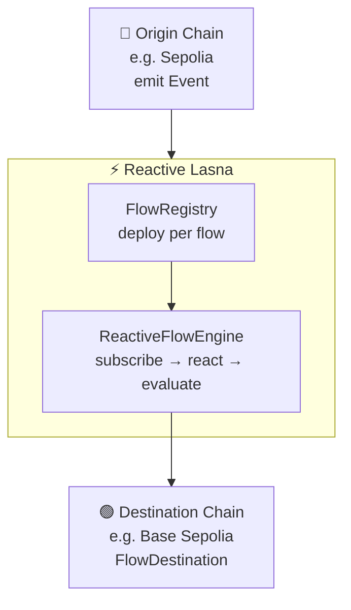
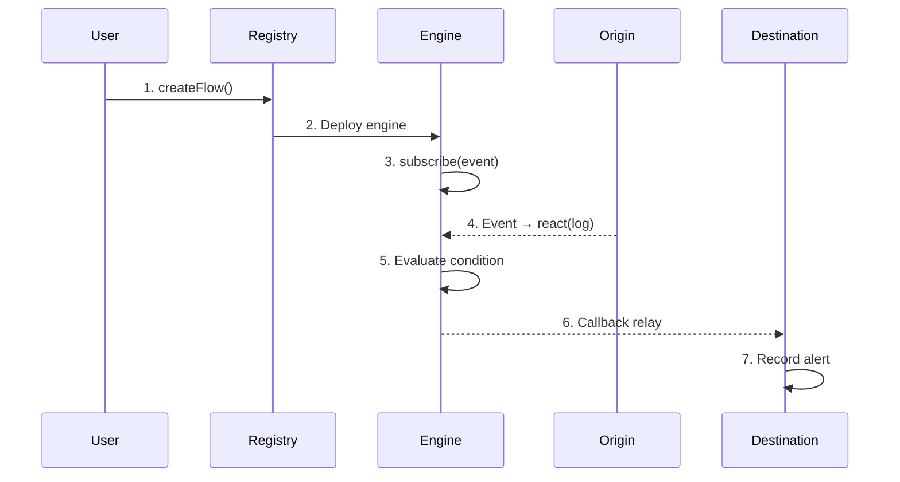

# ReactiveFlow

Cross-Chain IFTTT Workflow Orchestrator

<div class="pt-4 text-gray-400">
Powered by Reactive Network · Fully On-Chain · Zero Servers
</div>

<div class="abs-br m-6 flex gap-2">
  <a href="https://dev.reactive.network" target="_blank" class="text-sm opacity-50 !border-none">
    Reactive Network ↗
  </a>
</div>

---
transition: fade-out
---

# The Problem

Cross-chain automation today is broken

<div class="grid grid-cols-2 gap-8 pt-4">
<div>

### ❌ Current State

- Off-chain keepers & cron jobs
- Centralized relay servers
- Single point of failure
- Trust assumptions everywhere
- Complex DevOps overhead

</div>
<div>

### ✅ What We Need

- Fully on-chain execution
- No external dependencies
- Trustless & permissionless
- No servers to maintain
- Simple no-code setup

</div>
</div>

<div class="pt-8 text-center text-gray-400 text-sm">

*"What if cross-chain automation was as simple as setting up an email filter?"*

</div>

---

# What is ReactiveFlow?

A no-code platform for cross-chain automated workflows

<div class="grid grid-cols-3 gap-6 pt-6">
<div class="bg-gray-800/50 rounded-xl p-5">
  <div class="text-3xl mb-3">🔗</div>
  <h3 class="text-lg font-bold mb-2">Cross-Chain</h3>
  <p class="text-sm text-gray-400">Monitor events on one chain, execute actions on another</p>
</div>
<div class="bg-gray-800/50 rounded-xl p-5">
  <div class="text-3xl mb-3">⛓️</div>
  <h3 class="text-lg font-bold mb-2">Fully On-Chain</h3>
  <p class="text-sm text-gray-400">No servers, no keepers, no cron jobs — pure smart contracts</p>
</div>
<div class="bg-gray-800/50 rounded-xl p-5">
  <div class="text-3xl mb-3">🧩</div>
  <h3 class="text-lg font-bold mb-2">No-Code Builder</h3>
  <p class="text-sm text-gray-400">Visual 4-step wizard: Trigger → Condition → Action → Deploy</p>
</div>
</div>

<div class="pt-8 text-center">

**WHEN** an event fires → **IF** condition met → **THEN** execute action cross-chain

</div>

---

# Architecture — Factory + Three-Role Model

<div class="grid grid-cols-2 gap-6">
<div class="text-sm">

| Role | Chain | Contract |
|------|-------|----------|
| **Factory** | Reactive Lasna | `FlowRegistry` |
| **Origin** | Any EVM chain | User's contract |
| **Reactive** | Reactive Lasna | `ReactiveFlowEngine` |
| **Destination** | Any EVM chain | `FlowDestination` |

<p class="pt-2 text-xs text-gray-400">Each flow deploys its own isolated engine — no shared state.</p>

</div>
<div>



</div>
</div>

---

# How It Works — 7 Steps

<div class="grid grid-cols-[1fr_1fr] gap-6">
<div>



</div>
<div class="text-sm pt-4">

**User-Initiated (1-3)**
- Create flow via web UI
- Deploy `ReactiveFlowEngine` to Lasna
- Engine auto-subscribes to origin event

**Automated (4-5)**
- ReactVM detects event on origin chain
- Calls `react(log)`, evaluates condition

**Cross-Chain (6-7)**
- Callback emitted → Proxy relays to destination
- `FlowDestination` records alert on-chain

</div>
</div>

---

# Smart Contracts

<div class="grid grid-cols-2 gap-4">
<div>

### FlowRegistry (Factory)

```solidity {all|1-5|7-9}{maxHeight:'200px'}
struct FlowInfo {
  address reactiveContract;
  string  name;
  uint256 originChainId;
  address destinationContract;
  uint8   conditionOp;
  uint256 threshold;
  uint8   actionType;
  uint256 createdAt;
}

function registerFlow(...) external
function getUserFlows(addr) → FlowInfo[]
```

</div>
<div>

### ReactiveFlowEngine (Core)

```solidity {all}{maxHeight:'200px'}
function react(LogRecord calldata log)
  external vmOnly {
  if (maxExec > 0 && count >= maxExec)
    return;
  // Extract value from event data
  uint256 val = abi.decode(
    log.data[offset:offset+32], (uint256)
  );
  // Evaluate & emit callback
  if (!_evaluate(conditionOp, val, threshold))
    return;
  emit Callback(destChainId, destContract,
    CALLBACK_GAS_LIMIT, payload);
  executionCount++;
}
```

</div>
</div>

<div class="pt-3 text-xs text-gray-400 text-center">

Factory deploys isolated engines per flow · `react()` is called by ReactVM when subscribed events fire

</div>

---

# Condition Engine

6 operators + configurable data extraction

<div class="grid grid-cols-2 gap-8 pt-4">
<div>

### Operators

| Code | Operator | Example |
|------|----------|---------|
| `0` | NONE | Always execute |
| `1` | GT `>` | amount > 10,000 |
| `2` | LT `<` | price < 100 |
| `3` | GTE `>=` | balance >= 1 ETH |
| `4` | LTE `<=` | count <= 50 |
| `5` | EQ `==` | status == 1 |
| `6` | NEQ `!=` | sender != 0x0 |

</div>
<div>

### Data Extraction

```
Event: Transfer(from, to, amount)

Topics:
  topic0 = keccak256("Transfer(...)")
  topic1 = from (indexed)
  topic2 = to   (indexed)

Data:
  offset 0: amount  ← extracted here
  offset 1: (next 32 bytes if any)

dataOffset = 0 → reads amount
conditionOp = 3 (GTE)
threshold = 10000e18

→ "IF amount >= 10,000 tokens"
```

</div>
</div>

---

# Frontend — Flow Builder

4-step visual wizard

<div class="grid grid-cols-4 gap-3 pt-4">
<div class="bg-blue-900/30 border border-blue-500/30 rounded-xl p-4 text-center">
  <div class="text-2xl mb-2">①</div>
  <h4 class="font-bold text-sm">Trigger</h4>
  <p class="text-xs text-gray-400 mt-2">Select origin chain & event (ERC-20 Transfer or Custom)</p>
</div>
<div class="bg-purple-900/30 border border-purple-500/30 rounded-xl p-4 text-center">
  <div class="text-2xl mb-2">②</div>
  <h4 class="font-bold text-sm">Condition</h4>
  <p class="text-xs text-gray-400 mt-2">Choose operator & threshold (or skip for unconditional)</p>
</div>
<div class="bg-green-900/30 border border-green-500/30 rounded-xl p-4 text-center">
  <div class="text-2xl mb-2">③</div>
  <h4 class="font-bold text-sm">Action</h4>
  <p class="text-xs text-gray-400 mt-2">Select destination chain & action type (Alert / Callback)</p>
</div>
<div class="bg-orange-900/30 border border-orange-500/30 rounded-xl p-4 text-center">
  <div class="text-2xl mb-2">④</div>
  <h4 class="font-bold text-sm">Deploy</h4>
  <p class="text-xs text-gray-400 mt-2">Review config, one-click deploy to Reactive Lasna</p>
</div>
</div>

<div class="pt-6 text-sm">

### Deployment Process (2 transactions)

1. **Deploy** `ReactiveFlowEngine` to Reactive Lasna (0.1 ETH gas deposit)
2. **Register** flow metadata in `FlowRegistry` for on-chain persistence

Auto chain-switch · Auto token detection · Template pre-fill support

</div>

---

# Flow Templates

Pre-built cross-chain workflows

<div class="grid grid-cols-2 gap-4 pt-4">
<div class="bg-gray-800/50 rounded-xl p-4">
  <h4 class="font-bold text-blue-400">🐋 Cross-Chain Whale Alert</h4>
  <p class="text-xs text-gray-400 mt-1">Sepolia → Sepolia</p>
  <div class="text-sm mt-2">
    <b>WHEN</b> ERC-20 Transfer &nbsp;
    <b>IF</b> amount ≥ 10,000 &nbsp;
    <b>THEN</b> Alert
  </div>
</div>
<div class="bg-gray-800/50 rounded-xl p-4">
  <h4 class="font-bold text-purple-400">📊 Large Transfer Monitor</h4>
  <p class="text-xs text-gray-400 mt-1">Sepolia → Base Sepolia</p>
  <div class="text-sm mt-2">
    <b>WHEN</b> LargeTransfer &nbsp;
    <b>IF</b> amount ≥ 50,000 &nbsp;
    <b>THEN</b> Alert
  </div>
</div>
<div class="bg-gray-800/50 rounded-xl p-4">
  <h4 class="font-bold text-green-400">🌉 Cross-Chain Event Bridge</h4>
  <p class="text-xs text-gray-400 mt-1">Sepolia → Base Sepolia</p>
  <div class="text-sm mt-2">
    <b>WHEN</b> ERC-20 Transfer &nbsp;
    <b>IF</b> Always &nbsp;
    <b>THEN</b> Generic Callback
  </div>
</div>
<div class="bg-gray-800/50 rounded-xl p-4">
  <h4 class="font-bold text-orange-400">⚡ Unconditional Alert</h4>
  <p class="text-xs text-gray-400 mt-1">Sepolia → Sepolia</p>
  <div class="text-sm mt-2">
    <b>WHEN</b> ERC-20 Transfer &nbsp;
    <b>IF</b> Always &nbsp;
    <b>THEN</b> Alert
  </div>
</div>
</div>

---

# Tech Stack

<div class="grid grid-cols-2 gap-8 pt-4">
<div>

### Smart Contracts

| | |
|---|---|
| Language | Solidity 0.8 |
| Framework | Foundry (forge) |
| Library | [reactive-lib](https://github.com/Reactive-Network/reactive-lib) |
| Tests | 26 unit tests |
| Chains | Sepolia, Base Sepolia, Lasna |

### Key Numbers

| | |
|---|---|
| Servers | **0** |
| Cron jobs | **0** |
| External keepers | **0** |
| Condition operators | **6 + NONE** |
| Action types | **2** (Alert, Callback) |

</div>
<div>

### Frontend

| | |
|---|---|
| Framework | React 18 + Vite |
| Styling | TailwindCSS + shadcn/ui |
| Wallet | wagmi + RainbowKit |
| Chain interaction | viem |
| Backend | **None** — fully client-side |

### Architecture Highlights

- **Factory pattern** — FlowRegistry deploys per-flow engines
- **On-chain persistence** — no localStorage needed
- **Auto token detection** — ERC-20 symbol & decimals
- **Batch reads** — multicall for execution counts
- **Real-time tracking** — 30s auto-refresh

</div>
</div>

---

# Deployed Contracts

Testnet deployment (live & verified)

<div class="pt-4">

| Contract | Chain | Address |
|----------|-------|---------|
| **FlowRegistry** | Reactive Lasna | `0x29362Bf...Ea578` |
| **FlowOrigin** | Sepolia | `0x25859EF...916c` |
| **FlowDestination** | Sepolia | `0x56dcB06...644f` |
| **FlowDestination** | Base Sepolia | `0x14C2010...B5e` |

</div>

### ✅ Verified End-to-End Transactions

<div class="pt-2">

| Step | Chain | Description |
|------|-------|-------------|
| 1 | Sepolia | Origin Event — MOCA token Transfer detected |
| 2 | Reactive Lasna | FlowRegistry.createFlow() — engine deployed |
| 3 | Sepolia | Destination Callback — alert recorded on-chain |

</div>

<div class="pt-4 text-sm text-gray-400 text-center">

Full cross-chain cycle verified: **Origin Event → Reactive Engine → Destination Callback**

</div>

---
layout: center
class: text-center
---

# Live Demo

<div class="text-2xl text-gray-400 pt-4">

Create a Whale Alert flow in 60 seconds

</div>

<div class="grid grid-cols-4 gap-4 pt-8 text-sm">
<div class="text-blue-400">

**① Pick Trigger**<br/>ERC-20 Transfer<br/>on Sepolia

</div>
<div class="text-purple-400">

**② Set Condition**<br/>amount ≥ 10,000<br/>tokens

</div>
<div class="text-green-400">

**③ Choose Action**<br/>Alert callback<br/>on Base Sepolia

</div>
<div class="text-orange-400">

**④ Deploy**<br/>One-click<br/>to Reactive Lasna

</div>
</div>

---

# What's Next

<div class="grid grid-cols-2 gap-8 pt-6">
<div>

### Roadmap

- 🔜 Mainnet deployment
- 🔜 More origin/destination chains
- 🔜 Custom callback selectors
- 🔜 Flow marketplace (share & fork)
- 🔜 Advanced conditions (AND/OR logic)
- 🔜 Webhook + notification integrations

</div>
<div>

### Use Cases

- **DeFi** — Liquidation protection, auto-rebalancing
- **NFT** — Floor price alerts, auto-bidding
- **DAO** — Governance event bridging
- **Security** — Anomaly detection across chains
- **MEV** — Cross-chain arbitrage triggers
- **Gaming** — Cross-chain state sync

</div>
</div>

---
layout: center
class: text-center
---

# Thank You

<div class="text-xl text-gray-400 pt-4">
ReactiveFlow — Cross-Chain Automation, Simplified
</div>

<div class="pt-8 grid grid-cols-3 gap-8 text-sm">
<div>

**Zero Servers**<br/>Fully on-chain execution

</div>
<div>

**No-Code**<br/>Visual flow builder

</div>
<div>

**Cross-Chain**<br/>Powered by Reactive Network

</div>
</div>

<div class="pt-12 text-gray-500 text-sm">

Built for Pacifica Hackathon · Reactive Network Track

</div>
